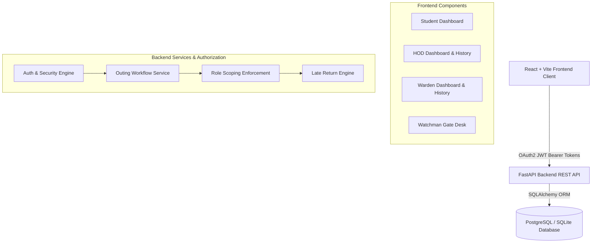
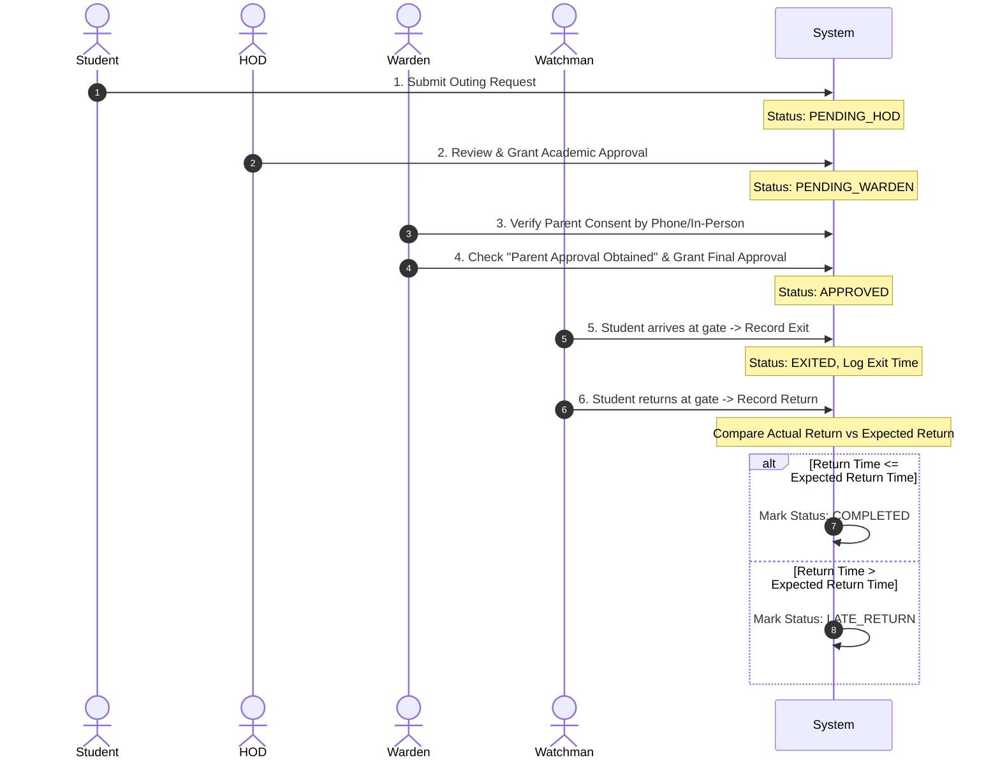

# System Architecture

## 1. Overview

The **Hostel Outing Permission & Approval Management System** is a full-stack web application designed for collegiate hostel administration. It automates student outing permission requests, multi-level approvals (HOD academic review and Warden parent-confirmed review), main gate verification, and role-scoped historical reporting with automated Late Return Detection.

---

## 2. Architecture

- **Frontend**: Single Page Application (SPA) built with React 18, TypeScript, Vite, React Router, and Tailwind CSS.
- **Backend API**: Asynchronous Python API built with FastAPI, Pydantic data validation, OAuth2 Password Bearer flow, and passlib/jose JWT security.
- **Database Layer**: Relational database (SQLite in development/testing, PostgreSQL in production) managed via SQLAlchemy ORM.

---

## 3. Roles & Responsibilities

| Role | Primary Responsibility | Authorization Scope |
| :--- | :--- | :--- |
| **STUDENT** | Submit outing requests, track status, cancel pending requests. | Own outing requests only. |
| **HOD** | Academic outing review, grant HOD approval or rejection. | Department-scoped (`User.department_id == hod.department_id`). |
| **WARDEN** | Verify parent/guardian consent via phone, grant final approval or rejection. | Hostel Block-scoped (`User.hostel_block_id == warden.hostel_block_id`). |
| **WATCHMAN** | Main gate security desk, student directory lookup, record exit and return. | Campus-wide gate operations & student directory lookup. |

---

## 4. Core Workflow

---

## 5. Backend Design & Middleware

- **Framework**: FastAPI (Python 3.12).
- **Authentication**: JWT tokens issued via `/api/auth/login` containing `sub` (email), `user_id`, and `role`.
- **Authorization**: `require_role([...])` dependency middleware enforcing HTTP 403 Forbidden for unauthorized endpoints.
- **Validation**: Pydantic schemas validating dates, times, register numbers, and payload formats.
- **Business Rules Enforcement**: Centralized in `OutingService` (`backend/app/services/outing_service.py`).

---

## 6. Database Schema & Tables

1. **`users`**: User profiles (id, name, register_number, email, password_hash, role, department_id, hostel_block_id, room_number, year, is_active).
2. **`departments`**: Academic departments (id, name, code).
3. **`hostel_blocks`**: Campus residential blocks (id, name).
4. **`outing_requests`**: Outing records (id, student_id, outing_date, leaving_time, expected_return_time, destination, reason, status, parent_approval_confirmed).
5. **`approval_history`**: Audit trail of decisions (id, outing_id, actor_id, actor_role, action, comment, timestamp).
6. **`gate_logs`**: Gate movement logs (id, outing_id, watchman_id, exit_time, return_time, delay_minutes, status).

---

## 7. Role-Based Authorization Scoping

- **HOD Scoping**: Backend enforces `User.department_id == current_user.department_id`. HODs cannot view or modify outings from other departments.
- **Warden Scoping**: Backend enforces `User.hostel_block_id == current_user.hostel_block_id`. Wardens cannot view or modify outings from other hostel blocks.
- **Query Parameter Safety**: Backend ignores frontend query string overrides for `department_id` or `hostel_block_id`, forcing authorization from the authenticated user's JWT context.

---

## 8. Audit Trail & Traceability

- Every status transition creates an immutable record in `approval_history`.
- Gate exit and return timestamps are recorded in `gate_logs`.
- Combined UI timeline shows exact timestamps, actor names, roles, actions, and comments.

---

## 9. Late Return Detection

- When Watchman records a return (`POST /api/watchman/outings/{id}/return`):
  - `expected_dt = datetime.combine(outing.outing_date, outing.expected_return_time)`
  - `actual_dt = datetime.utcnow()`
  - `is_late = actual_dt > expected_dt`
- If `is_late` is `True`:
  - `outing.status = LATE_RETURN`
  - `gate_log.status = LATE_RETURN`
  - `gate_log.delay_minutes = max(1, int((actual_dt - expected_dt).total_seconds() // 60))`
  - Audit action `LATE_RETURN_DETECTED` appended to history.
- Otherwise:
  - `outing.status = COMPLETED`
  - `gate_log.status = COMPLETED`
