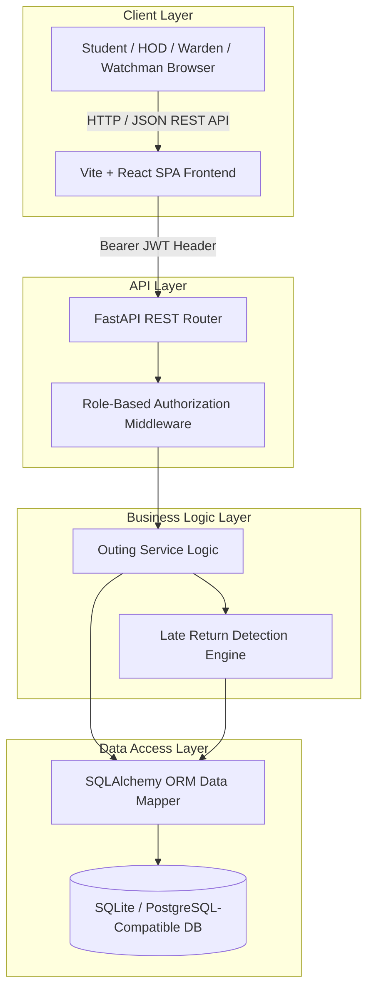
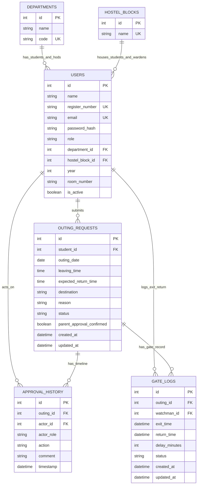
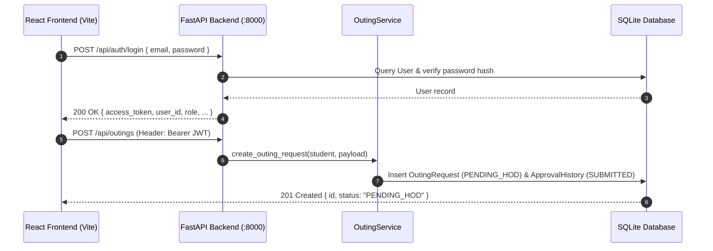
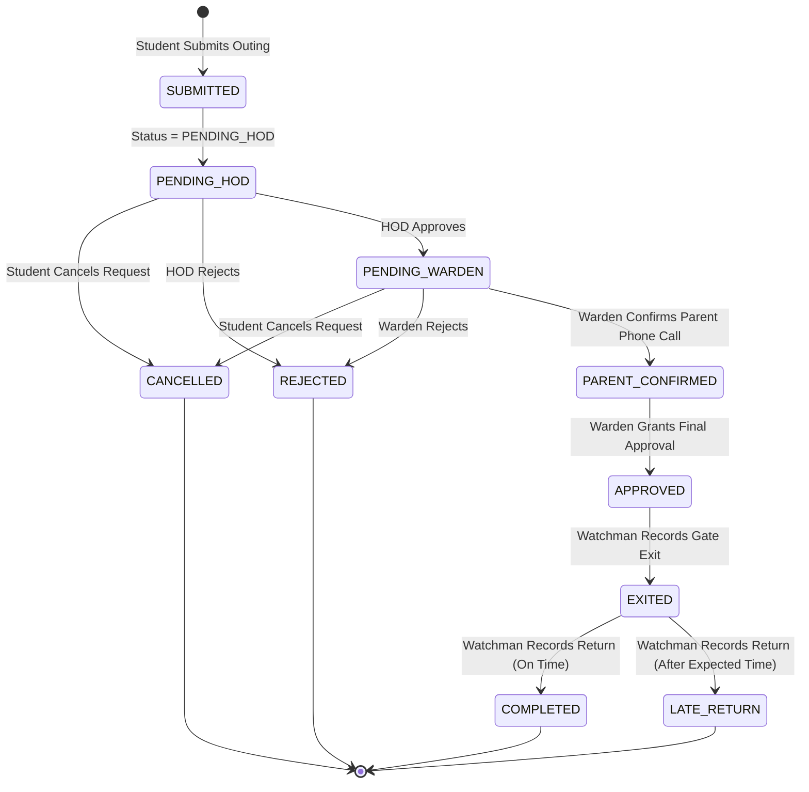

# Hostel Outing Permission & Approval Management System
## System Architecture

---

## 1. Project Overview

The **Hostel Outing Permission & Approval Management System** is a full-stack enterprise web application designed for collegiate hostel administration. It automates the lifecycle of student outing permissions through a multi-tier authorization workflow involving Students, Heads of Department (HOD), Hostel Wardens, and Main Gate Watchmen across multiple academic departments and hostel blocks.

The system replaces manual paper slips with a digital, real-time approval hierarchy featuring parent consent verification, campus gate movement logging, centralized audit trails, and automated **Late Return Detection**.

---

## 2. Problem Statement

Collegiate residential institutions traditionally rely on manual paper outing slips, physical gate logbooks, and unverified phone calls. This legacy model introduces severe administrative flaws:
- **Approval Bottlenecks**: Physical movement of slips between academic departments and hostel blocks causes long waiting times.
- **Security & Authorization Risks**: Unverified parent permission calls and lack of scope isolation allow unauthorized off-campus excursions.
- **Gate Verification Challenges**: Watchmen at campus gates lack real-time mechanisms to verify if a student possesses authentic, current approval.
- **Untracked Late Returns**: Manual registers fail to calculate or flag delay durations when students return after their expected deadline.
- **Lack of Auditability**: Absence of a centralized, immutable audit history prevents retrospective administrative review.

---

## 3. Solution Overview

The system resolves these challenges through a unified digital platform:
1. **Multi-Role Scoped Access**: Dedicated, isolated workflows for `STUDENT`, `HOD`, `WARDEN`, and `WATCHMAN`.
2. **Automated Multi-Stage Routing**: Outings submitted by students automatically route to their department's HOD for academic review, then to their hostel block's Warden for parent-confirmed approval.
3. **Mandatory Parent Confirmation**: Wardens must explicitly verify parent/guardian consent before granting final clearance.
4. **Instant Gate Operations**: Watchmen search students by Register Number, Name, or Outing ID, verifying final approval and recording exit/return with a single click.
5. **Automated Late Return Detection**: Compares actual return timestamps against expected return deadlines, automatically calculating delay minutes and marking `LATE_RETURN` without blocking student entry.
6. **Immutable Audit History**: Records every action, actor, timestamp, and comment in a centralized audit log.

---

## 4. High-Level Architecture

The application follows a modern decoupled architecture: a Single Page Application (SPA) frontend communicating over REST APIs with an asynchronous Python FastAPI backend, backed by SQLAlchemy ORM and a relational database.



### Component Data Pipeline
```
Student Input → React Frontend → FastAPI REST API → Business Logic / Services → SQLAlchemy ORM → SQLite / PostgreSQL-compatible database
```

---

## 5. Frontend Architecture

The frontend is built as an SPA using React 18, TypeScript, Vite, React Router DOM, and Tailwind CSS.

### Key Directory Structure (`frontend/src/`)
- `pages/`: Role-specific view components:
  - `LoginPage.tsx`: Single sign-in portal supporting all four roles.
  - `SignupPage.tsx`: Public registration for Students, HODs, and Wardens.
  - `StudentDashboard.tsx`: Outing creation form, active request tracking, history modal.
  - `HodDashboard.tsx` & `HodHistory.tsx`: Pending department approvals and department audit history.
  - `WardenDashboard.tsx` & `WardenHistory.tsx`: Pending block approvals, parent confirmation checkbox, block history.
  - `WatchmanDashboard.tsx`: Gate exit/return logging desk and campus student directory.
- `components/`: Reusable UI elements:
  - `Navbar.tsx`: Global navigation header with user profile badge and logout.
  - `StatusBadge.tsx`: Color-coded status badge indicator (`PENDING_HOD`, `PENDING_WARDEN`, `APPROVED`, `REJECTED`, `CANCELLED`, `EXITED`, `COMPLETED`, `LATE_RETURN`).
  - `Timeline.tsx`: Vertical audit trail timeline displaying historical decisions.
  - `OutingDetailModal.tsx`: Comprehensive modal overlay showing student details and audit history.
- `services/api.ts`: Centralized Axios client with JWT interceptors.

---

## 6. Backend Architecture

The backend is engineered using Python 3.10+ and FastAPI, adhering to clean architecture principles:

```text
backend/app/
├── api/                  # FastAPI APIRouter endpoints
│   ├── auth.py           # Signup, Login, /me profile
│   ├── departments.py    # Academic department listing
│   ├── hostel_blocks.py  # Hostel block listing
│   ├── outings.py        # Student outing request endpoints
│   ├── hod.py            # HOD approval & department history endpoints
│   ├── warden.py         # Warden parent confirmation, approval & block history endpoints
│   └── watchman.py       # Gate desk operations & student directory endpoints
├── auth/                 # Authentication & Security
│   └── security.py       # Passlib Bcrypt hashing, Jose JWT generation/decoding, OAuth2 scheme
├── database/             # Database Connection Management
│   └── session.py        # SQLAlchemy engine, SessionLocal factory, Base declarative class
├── models/               # SQLAlchemy ORM Models
│   ├── user.py           # User entity
│   ├── department.py     # Department entity
│   ├── hostel_block.py   # HostelBlock entity
│   ├── outing.py         # OutingRequest entity
│   ├── history.py        # ApprovalHistory audit entity
│   ├── gatelog.py        # GateLog movement entity
│   └── enums.py          # Python Role, OutingStatus, ApprovalAction, GateStatus Enums
├── schemas/              # Pydantic Validation Models
│   ├── user.py & signup.py # Auth payloads & responses
│   ├── outing.py         # Outing creation, filtering, & response schemas
│   ├── history.py        # Audit timeline response schema
│   └── gatelog.py        # Gate log movement schema
└── services/             # Core Business Logic
    └── outing_service.py # State machine, validation rules, late return detection logic
```

---

## 7. Database Architecture

The persistence layer uses SQLAlchemy 2.0 ORM configured for SQLite in development (`hostel_outing.db`) and compatible with PostgreSQL for production deployments.

### Relational Entity-Relationship Diagram



---

## 8. Authentication Architecture

The system uses OAuth2 Password Bearer Flow with JSON Web Tokens (JWT).

1. **Credentials Validation**: `POST /api/auth/login` verifies user email and checks password against Bcrypt hashes using `passlib.context.CryptContext`.
2. **Token Generation**: Generates an HS256-signed JWT containing:
   - `sub`: User email address
   - `user_id`: Primary key of user
   - `role`: Role string (`STUDENT`, `HOD`, `WARDEN`, `WATCHMAN`)
   - `exp`: Expiration timestamp
3. **Session Interception**: Client attaches header `Authorization: Bearer <token>` to all protected API calls.

---

## 9. Role-Based Authorization

Access control is enforced via FastAPI Dependency Injection (`get_current_user` and custom role validators).

| Role | System Scope | Primary Actions |
| :--- | :--- | :--- |
| **`STUDENT`** | Self-scoped | Create outing requests, view personal status/history, cancel pending requests. |
| **`HOD`** | Department-scoped (`User.department_id`) | Review pending academic requests, grant HOD approval, reject requests, view department audit history. |
| **`WARDEN`** | Hostel-block-scoped (`User.hostel_block_id`) | Review HOD-approved requests, verify parent approval flag, grant final Warden approval, reject requests, view block audit history. |
| **`WATCHMAN`** | Campus-wide gate desk | Search student directory, verify final approval status, record gate exit, record gate return. |

---

## 10. Department Scoping

- HOD accounts are bound to a specific academic department via `User.department_id`.
- The endpoint `GET /api/hod/outings/pending` filters requests where the requesting student's `department_id` matches the logged-in HOD's `department_id`.
- Cross-department access attempts return `HTTP 403 Forbidden`.

---

## 11. Hostel Block Scoping

- Warden accounts are bound to a specific hostel block via `User.hostel_block_id`.
- The endpoint `GET /api/warden/outings/pending` filters HOD-approved requests where the student's `hostel_block_id` matches the logged-in Warden's `hostel_block_id`.
- Cross-block access attempts return `HTTP 403 Forbidden`.

---

## 12. Gate Security Architecture

- The Main Gate Watchman operates a campus-wide desk.
- Watchmen query the student directory or active outing requests by Register Number, Student Name, or Outing ID (`#OUT-X`).
- **Exit Rule**: Exit can ONLY be recorded if the request status is strictly `APPROVED`.
- **Return Rule**: Return can ONLY be recorded if the request status is strictly `EXITED`.

---

## 13. Audit / History Architecture

- Status transitions trigger immutable inserts into `approval_history`.
- History records store: `outing_id`, `actor_id`, `actor_role`, `action` (`ApprovalAction`), `comment`, and `timestamp`.
- Audit history is accessible to authenticated users based on their authorization scope.

---

## 14. Late-Return Detection Architecture

Late return detection is handled in `OutingService.watchman_record_return`:

1. When a Watchman records a return:
   ```python
   now = datetime.now()
   expected_dt = datetime.combine(outing.outing_date, outing.expected_return_time)
   is_late = now > expected_dt
   ```
2. **If `is_late == True`**:
   - `delay_seconds = (now - expected_dt).total_seconds()`
   - `delay_minutes = max(1, int(round(delay_seconds / 60.0)))`
   - Sets `outing.status = OutingStatus.LATE_RETURN`
   - Sets `gate_log.status = GateStatus.LATE_RETURN` and `gate_log.delay_minutes = delay_minutes`
   - Inserts audit history records: `RETURN_RECORDED` followed by `LATE_RETURN_DETECTED` with formatted delay details.
3. **If `is_late == False`**:
   - Sets `outing.status = OutingStatus.COMPLETED`
   - Sets `gate_log.status = GateStatus.COMPLETED` and `gate_log.delay_minutes = 0`
   - Inserts audit history records: `RETURN_RECORDED` followed by `COMPLETED`.

> [!NOTE]
> Students returning late are **never blocked** from entering campus. The system records the entry, logs delay minutes, and notifies administration via history dashboards.

---

## 15. API Communication Flow



---

## 16. End-to-End Workflow



---

## 17. Technology Stack

| Layer | Technology | Specification / Library |
| :--- | :--- | :--- |
| **Frontend Framework** | React | React 18.3.1 (TypeScript 5.5.3) |
| **Frontend Build Tool** | Vite | Vite 5.4.1 |
| **Frontend Styling** | Tailwind CSS | Tailwind 3.4.10, Lucide React icons |
| **HTTP Client** | Axios | Axios 1.7.4 with JWT authorization interceptor |
| **Backend Framework** | FastAPI | FastAPI 0.110.0+ (Python 3.10+) |
| **ASGI Server** | Uvicorn | Uvicorn 0.28.0+ |
| **ORM & Database** | SQLAlchemy / SQLite | SQLAlchemy 2.0.28+, SQLite (PostgreSQL compatible) |
| **Data Validation** | Pydantic | Pydantic 2.6.4+ & Pydantic-Settings |
| **Authentication** | Passlib & Python-Jose | Bcrypt password hashing, HS256 JWT tokens |
| **Backend Testing** | Pytest | Pytest 8.1.1+, Pytest-Asyncio, HTTPX TestClient |
| **E2E Testing** | Playwright | Playwright 1.40+ (TypeScript E2E scenarios) |

---

## 18. Project Directory Structure

```text
Hostel_Outpass_System/
├── hostel_outing.db                      # SQLite Persistent Development Database
├── docker-compose.yml                    # Containerization configuration
├── pytest.ini                            # Pytest configuration
├── README.md                             # Project overview & documentation index
├── backend/                              # Python FastAPI Backend
│   ├── app/                              # Application modules
│   │   ├── api/                          # REST API route handlers
│   │   ├── auth/                         # Security & token handlers
│   │   ├── database/                     # SQLAlchemy session & base setup
│   │   ├── models/                       # Database ORM entity models
│   │   ├── schemas/                      # Pydantic schemas
│   │   └── services/                     # Business logic & late return service
│   ├── tests/                            # Pytest suite (83 test cases)
│   ├── seed_data.py                      # Idempotent database seeder
│   └── requirements.txt                  # Python dependencies
├── frontend/                             # React TypeScript Frontend
│   ├── src/                              # SPA source code
│   │   ├── components/                   # Reusable UI components
│   │   ├── pages/                        # Role dashboards & view pages
│   │   ├── services/                     # Axios API service
│   │   └── types/                        # TypeScript type definitions
│   ├── package.json                      # Node dependencies & scripts
│   └── vite.config.ts                    # Vite config & proxy rules
├── e2e/                                  # Playwright E2E test suite
│   ├── playwright.config.ts              # Playwright test config
│   └── *.spec.ts                         # E2E test specs
├── docs/                                 # Documentation suite
│   ├── architecture.md                   # System Architecture (This file)
│   ├── design.md                         # Detailed System Design
│   ├── user-guide.md                     # End-User Manual
│   ├── api.md                            # Complete REST API Reference
│   └── setup.md                          # Setup, Execution & Testing Guide
└── evidence/                             # Quality Assurance Evidence
    ├── ai-change-loop.md                 # Stage 3 AI Development Loop Documentation
    └── red-run.md                        # Deliberate Defect Red-Run Report
```
