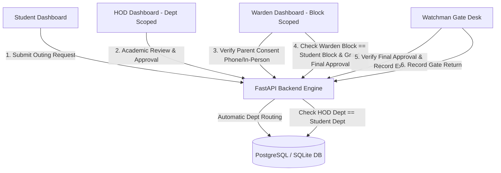

# System Architecture - Hostel Outing Permission & Approval System

## 1. System Overview

The **Hostel Outing Permission & Approval Management System** is a production-grade full-stack web application designed for collegiate hostel administration. It supports a multi-user, multi-department, and multi-hostel block organizational structure with strict backend-enforced role authorization.

---

## 2. Organizational Scoping & Multi-User Architecture

1. **Departments**: `CSE` (Computer Science & Engineering), `ECE` (Electronics & Communication), `EEE` (Electrical & Electronics), `MECH` (Mechanical Engineering).
   - Students and HODs belong to a specific department.
   - HODs only see and process outing requests for students in their assigned department.
   - Attempts by an HOD to view, approve, or reject an outing for another department return `HTTP 403 Forbidden`.

2. **Hostel Blocks**: `A Block`, `B Block`, `C Block`.
   - Students and Wardens belong to a specific hostel block.
   - Wardens only see and process outing requests for students in their assigned hostel block.
   - Attempts by a Warden to view, confirm parent approval, approve, or reject an outing for another hostel block return `HTTP 403 Forbidden`.

3. **Automatic Routing**: Students raise requests without manually picking an HOD or Warden. Routing is automatically derived from the student's department and hostel block.
