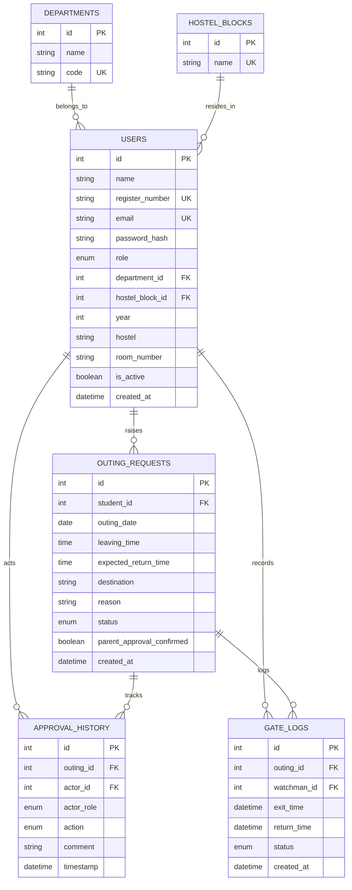

# Database Design & API Schema Documentation

## 1. Database Entity-Relationship Diagram

---

## 2. Authorization Rules & Scoping Matrix

| Endpoint | Role | Authorization Constraint | Unauthorized Access Behavior |
| :--- | :--- | :--- | :--- |
| `GET /api/hod/outings/pending` | HOD | Filters to `student.department_id == current_user.department_id` | Returns empty list for other departments |
| `GET/POST /api/hod/outings/{id}/*` | HOD | Verifies `student.department_id == current_user.department_id` | `HTTP 403 Forbidden` |
| `GET /api/warden/outings/pending` | WARDEN | Filters to `student.hostel_block_id == current_user.hostel_block_id` | Returns empty list for other blocks |
| `GET/POST /api/warden/outings/{id}/*` | WARDEN | Verifies `student.hostel_block_id == current_user.hostel_block_id` | `HTTP 403 Forbidden` |
| `POST /api/watchman/outings/{id}/exit` | WATCHMAN | Verifies `status == APPROVED` | `HTTP 400 Bad Request` ("Student is not authorized to leave") |
| `POST /api/watchman/outings/{id}/return` | WATCHMAN | Verifies `status == EXITED` | `HTTP 400 Bad Request` ("Return cannot be recorded before exit") |
