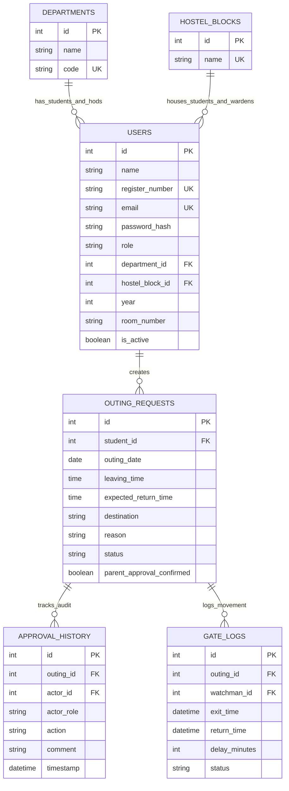

# System Design

## 1. Problem Statement

Collegiate hostels historically rely on manual paper outing slips, physical registers, and unstructured phone coordination to grant students permission to leave campus. This leads to approval bottlenecks, verification difficulties at the gate, untracked late returns, and lack of administrative audit history.

---

## 2. System Goals

1. **Digitize Outing Approvals**: Replace paper slips with a role-based approval pipeline.
2. **Eliminate Approval Delays**: Enable HODs and Wardens to review requests asynchronously.
3. **Enforce Parent Approval Verification**: Ensure Wardens confirm parent/guardian consent before granting final approval.
4. **Instant Gate Verification**: Provide Watchmen with real-time student directory lookup and approval status checking at campus gates.
5. **Automate Late Return Detection**: Automatically flag late returns and log exact delay minutes.
6. **Role-Scoped Transparency**: Provide HODs (department-scoped) and Wardens (hostel-block-scoped) with read-only historical reports.

---

## 3. System Users

- **Student**: Raises outing requests, tracks progress, cancels pending requests.
- **HOD (Head of Department)**: Evaluates academic outing validity for department students.
- **Warden**: Verifies parent consent by phone/in person and grants final block approval.
- **Watchman (Gate Officer)**: Scans/searches students at the main gate, records exit and return times.

---

## 4. Functional Requirements

- **Registration & Auth**: Multi-role signup (`STUDENT`, `HOD`, `WARDEN`) with automatic department and block linking; Watchman accounts provisioned securely.
- **Outing Request Lifecycle**: `PENDING_HOD` -> `PENDING_WARDEN` -> `APPROVED` -> `EXITED` -> `COMPLETED` / `LATE_RETURN`.
- **Parent Confirmation Enforcement**: Final Warden approval rejected unless `parent_approval_confirmed == True`.
- **Main Gate Verification & Directory**: Watchman directory search by Register Number, Outing ID, or Name, displaying student photos, profile details, and gate movement buttons.
- **Role-Scoped Outing History**: Dedicated `/hod/history` and `/warden/history` dashboards with summary statistics cards, search, status filters, block/dept filters, and detailed audit timelines.

---

## 5. Business Rules

### Student Rules
- Outing date cannot be in the past.
- Leaving time must be strictly before expected return time.
- Cannot create overlapping active outing requests.
- Can cancel requests in `PENDING_HOD` or `PENDING_WARDEN` status.

### HOD Rules
- HOD can only process requests for students in their assigned department (`User.department_id`).
- Approving a request advances status to `PENDING_WARDEN`.
- Rejecting a request terminates the workflow with `REJECTED`.

### Warden Rules
- Warden can only process requests for students in their assigned hostel block (`User.hostel_block_id`).
- Must explicitly confirm parent consent (`parent_approval_confirmed = True`) before granting final approval.
- Final approval advances status to `APPROVED`.

### Watchman Rules
- Exit can only be recorded for requests in `APPROVED` status.
- Return can only be recorded for requests in `EXITED` status.
- Watchman cannot approve or reject outing requests.

### Late Return Rules
- When return is recorded, if `actual_return_time > expected_return_time`, outing status is marked `LATE_RETURN`.
- Late students are NEVER blocked from entering the gate; the system records the delay and updates audit history.

---

## 6. Non-Functional Requirements

- **Security**: Passwords hashed with bcrypt; JWT tokens with role claims; HTTPS/TLS transport.
- **Reliability**: Deterministic database transactions; rollback on validation errors.
- **Maintainability**: Modular layered architecture (UI, API Service, Data Access).
- **Usability**: Responsive, accessible Tailwind UI with status badges and micro-animations.
- **Auditability**: Immutable audit trail for every status transition and gate event.
- **Performance**: Instant search indexing and sub-100ms API response times.

---

## 7. Data Model & Relationships

---

## 8. UI Design Standards

- Modern dark/light UI palette using Slate, Brand Indigo/Purple, Emerald, Rose, and Amber accents.
- Responsive container layouts using Tailwind CSS.
- Modal dialogs for detailed student audit timeline inspection.
- Accessible ARIA labels and status indicators (`StatusBadge.tsx`).

---

## 9. Error Handling Strategy

- **API Layer**: Standardized JSON error responses (`HTTP 400`, `HTTP 401`, `HTTP 403`, `HTTP 404`).
- **Frontend Layer**: Inline alert banners and toast notifications displaying user-friendly error messages without crashing UI state.

---

## 10. Testing Strategy

- **Backend Unit & Integration Tests**: Pytest suite executing 74 automated tests covering auth, workflow transitions, security scoping, seed verification, and late return detection.
- **Frontend E2E Tests**: Playwright suite executing 8 end-to-end browser scenarios covering multi-role signup, full outing approval lifecycle, Watchman directory operations, and role-scoped history scoping.
- **Build Verification**: TypeScript strict mode (`tsc --noEmit`) and Vite production bundler validation.

---

## 11. Stage 3 AI Development Loop

Late Return Detection was introduced using an AI-assisted development loop:
1. **Requirement Injection**: Defined business rule comparing actual return vs expected return timestamp.
2. **Red Run**: Ran test suite catching explicit `AssertionError` (`assert 'COMPLETED' == 'LATE_RETURN'`).
3. **AI Root Cause Analysis & Fix**: Updated timestamp comparison in `OutingService.watchman_record_return`.
4. **Green Run**: Verified 100% test pass rate across backend pytest and Playwright E2E suites.
